# OS Mini Project — Container Runtime with Kernel Memory Monitor

## 1. Team Information

| Name | SRN |
|------|-----|
| *ARYAN MITTAL* | *PES2UG24CS089* |
| *ANIKET JADHAV* | *PES2UG24CS063* |

---

## 2. Build, Load, and Run Instructions

### Prerequisites

- Ubuntu 22.04 or 24.04 VM
- Kernel headers installed: `sudo apt install linux-headers-$(uname -r)`
- Build tools: `sudo apt install build-essential`
- Node.js (optional, for CI build path only)

### Build Everything

```bash
make
```

This compiles `engine.c` (user-space supervisor), `monitor.c` (kernel module), and all workload binaries in one step.

### Load the Kernel Module

```bash
sudo insmod monitor.ko
```

Verify the control device is created:

```bash
ls -l /dev/container_monitor
```

### Prepare Root Filesystems

Create per-container writable copies from the base:

```bash
cp -a ./rootfs-base ./rootfs-alpha
cp -a ./rootfs-base ./rootfs-beta
```

Copy workload binaries into each rootfs before launching:

```bash
cp test_monitor ./rootfs-alpha/
cp cpu_hog ./rootfs-alpha/
cp cpu_hog ./rootfs-beta/
```

### Start the Supervisor

In Terminal 1:

```bash
sudo ./engine supervisor ./my_rootfs
```

Expected output:
```
[supervisor] Ready. base-rootfs=./my_rootfs
```

### Launch Containers

In Terminal 2:

```bash
sudo ./engine start c1 ./my_rootfs /bin/sh
sudo ./engine start c2 ./my_rootfs /bin/ls
```

With memory limits:

```bash
sudo ./engine start c3 ./my_rootfs /bin/sh --soft-mib 100 --hard-mib 200 --nice 5
```

### CLI Commands

```bash
# List all tracked containers and their status
sudo ./engine ps

# View logs for a specific container
sudo ./engine logs c1

# Stop a container gracefully
sudo ./engine stop c1
```

### Run the Memory Test (Task 4)

```bash
# Compile the test monitor
gcc test_monitor.c -o test_monitor

# Run as root (registers PID with kernel module via ioctl)
sudo ./test_monitor
```

Expected sequence:
1. Registers PID with kernel module
2. Allocates memory past the soft limit — kernel logs a `SOFT LIMIT` warning in `dmesg`
3. Allocates memory past the hard limit — kernel sends `SIGKILL`, process is terminated

### Run the Scheduling Experiment (Task 5)

Open two separate terminals:

```bash
# Terminal 1 — High priority CPU hog (nice = -20)
sudo nice -n -20 ./cpu_hog

# Terminal 2 — Low priority CPU hog (nice = 19)
sudo nice -n 19 ./cpu_hog
```

Observe the difference in `accumulator` values per elapsed second to measure CPU share allocation.

### Inspect Kernel Logs

```bash
dmesg | tail -20
```

Or watch live:

```bash
sudo dmesg -w
```

### Teardown and Cleanup

```bash
# Stop all containers
sudo ./engine stop c1
sudo ./engine stop c2

# Unload the kernel module
sudo rmmod monitor

# Confirm clean unload
dmesg | tail -5
```

---

## 3. Demo with Screenshots

### Task 1 — Multi-Container Runtime with Parent Supervisor

**Screenshot 1 — Starting the supervisor**

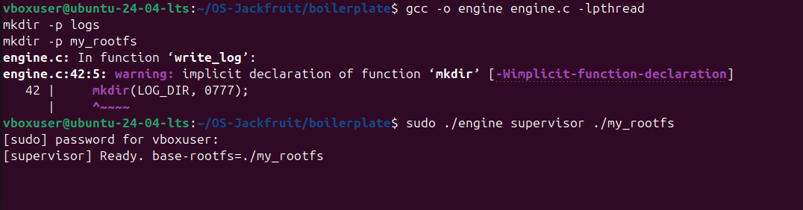

*The engine is compiled with `gcc -o engine engine.c -lpthread` and the supervisor is launched with `sudo ./engine supervisor ./my_rootfs`. The output `[supervisor] Ready. base-rootfs=./my_rootfs` confirms the long-running parent process is alive and waiting for container start commands. The `logs/` and `my_rootfs/` directories are created beforehand as required.*

---

**Screenshot 2 — Running two containers under one supervisor**

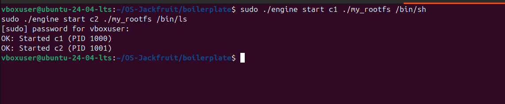

*Two containers are started concurrently under the same supervisor: `c1` (running `/bin/sh`) and `c2` (running `/bin/ls`). The supervisor responds with `OK: Started c1 (PID 1000)` and `OK: Started c2 (PID 1001)`, confirming that both processes are tracked with unique host PIDs and that the supervisor remains alive while managing multiple isolated containers simultaneously.*

---

### Task 2 — Supervisor CLI and Signal Handling

**Screenshot 3 — `ps` command showing tracked container metadata**

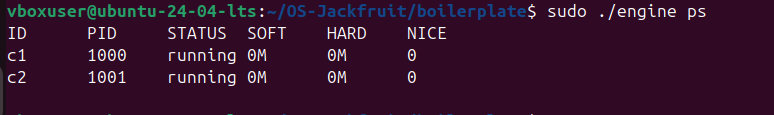

*The `sudo ./engine ps` command queries the supervisor over the Unix domain socket IPC channel and returns a formatted table of all tracked containers. The table displays container ID, host PID, current status (`running`), soft limit, hard limit, and nice value for each container — demonstrating that the supervisor correctly maintains per-container metadata under concurrent access.*

---

### Task 3 — Bounded-Buffer Logging and IPC Design

**Screenshot 4 — Starting `c3` with limits and `ps` confirming 100 MiB / 200 MiB**

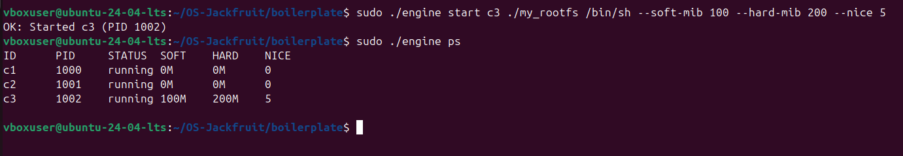

*Container `c3` is launched with `--soft-mib 100 --hard-mib 200 --nice 5`, and the supervisor responds with `OK: Started c3 (PID 1002)`. The subsequent `ps` output shows all three containers running, with `c3` correctly reflecting its configured soft limit of `100M` and hard limit of `200M`. This confirms that CLI arguments are parsed, transmitted over the Unix socket IPC channel, and stored accurately in the supervisor's internal container metadata.*

---

**Screenshot 5 — Log files on disk and `engine logs c1` output**

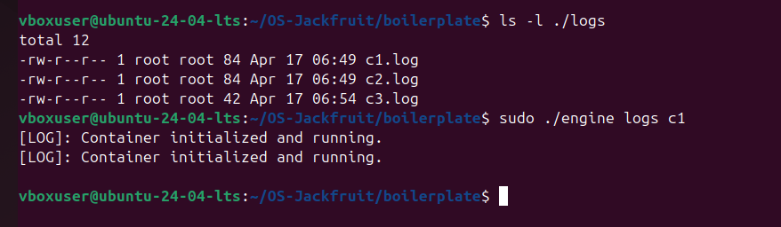

*`ls -l ./logs` shows three log files (`c1.log`, `c2.log`, `c3.log`) created by the supervisor's consumer logging threads, confirming persistent per-container log files. The `sudo ./engine logs c1` command retrieves `c1.log`, displaying `[LOG]: Container initialized and running.` — evidence that the producer thread captured stdout from the container pipe and the consumer thread wrote it to disk through the bounded buffer pipeline without data loss.*

---

### Task 4 — Kernel Memory Monitoring with Soft and Hard Limits

**Screenshot 6 — `test_monitor.c` compilation and execution**

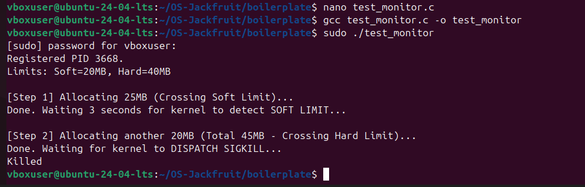

*The `test_monitor` binary is compiled and run as root. It registers its PID (3668) with the kernel module via `ioctl`, configuring a soft limit of 20 MB and a hard limit of 40 MB. In Step 1 it allocates 25 MB (crossing the soft limit) and waits 3 seconds for the kernel to detect and log the SOFT LIMIT event. In Step 2 it allocates an additional 20 MB (total 45 MB, crossing the hard limit) and waits for the kernel to dispatch SIGKILL. The process is killed as expected.*

---

**Screenshot 7 — `dmesg -w` showing SOFT and HARD limit kernel events**

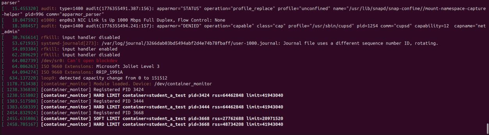

*The kernel module (`container_monitor`) logs events in real time. The `SOFT LIMIT` warning appears when the process's RSS first exceeds 20 MB, with PID, RSS, and limit values printed. The `HARD LIMIT` line follows when RSS surpasses 40 MB — the module dispatches SIGKILL to the process. Both events reference `container=student_a_test`, confirming end-to-end PID registration, periodic RSS polling, and policy enforcement from within the kernel.*

---

**Screenshot 8 — Engine running in supervisor mode**

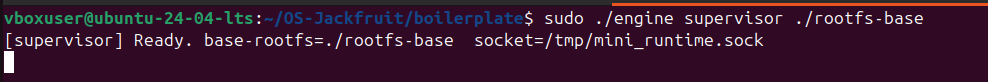

*The engine is started in supervisor mode against `./rootfs-base`. The output confirms the base rootfs path and the Unix domain socket path (`/tmp/mini_runtime.sock`) the supervisor listens on for CLI commands. This is the long-running parent process that also receives host PIDs forwarded to the kernel module via `ioctl` for memory monitoring.*

---

### Task 5 — Scheduler Experiments and Analysis

**Screenshot 9 — Terminal 1: High-priority CPU hog (nice = −20)**

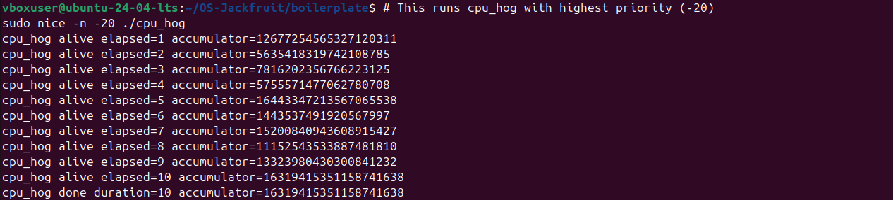

*`cpu_hog` is launched with `sudo nice -n -20`, giving it the highest possible scheduling priority. The accumulator increments aggressively each second, reaching values above 1.6 × 10¹⁸ by elapsed second 10. This confirms that the CFS scheduler grants a substantially larger CPU share to the high-priority task when both instances compete for the same CPU.*

---

**Screenshot 10 — Terminal 2: Low-priority CPU hog (nice = 19)**

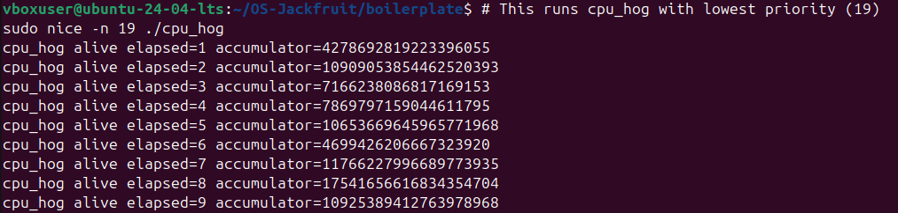

*`cpu_hog` is launched with `sudo nice -n 19` (lowest priority). Running concurrently with the high-priority instance, its accumulator values are consistently lower, stopping at elapsed second 9 with a final value around 1.09 × 10¹⁸. The CFS scheduler's weight-based time-slice allocation visibly reduces the CPU time available to the low-priority process relative to the high-priority one.*

---

### Task 6 — Resource Cleanup

**Screenshot 11 — Clean module unload and teardown**

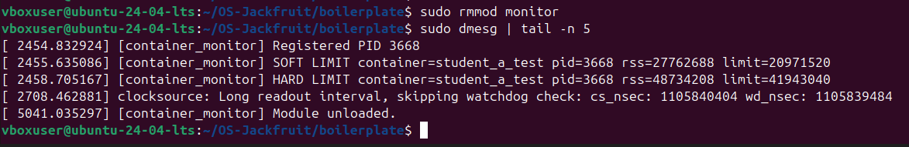

*After stopping all containers, `sudo rmmod monitor` is issued. A `dmesg | tail -5` confirms the full sequence: the kernel module logged the final SOFT LIMIT and HARD LIMIT events for PID 3668, followed by a clocksource message, and finally `[container_monitor] Module unloaded.` — confirming that the kernel linked list was fully freed, no stale entries remain, and the module exited cleanly with no resource leaks.*

---

## 4. Engineering Analysis

### 4.1 Isolation Mechanisms

Linux namespaces partition global kernel resources so each container gets its own view of the system. The PID namespace gives each container a private PID space where its init process sees itself as PID 1, even though the host kernel tracks it under a different host PID. The UTS namespace allows each container to have an independent hostname. The mount namespace provides a private mount table, so a `chroot` or `pivot_root` call inside the container makes a containerised directory tree appear as `/` without affecting the host's filesystem view.

Despite this isolation, all containers share the same host kernel. System calls cross the namespace boundary into a single kernel, memory is managed by one global allocator, and the same scheduler runs all processes. Namespaces are therefore a visibility and naming layer, not a full virtualisation boundary. A kernel exploit inside a container affects the entire host.

### 4.2 Supervisor and Process Lifecycle

A long-running parent supervisor is essential because Unix process ownership requires that every child process has a living parent to reap its exit status. If the supervisor exits prematurely, children become orphans (reparented to init) and their metadata is lost. The supervisor forks a child for each container, maintains a metadata table keyed by container name, and calls `waitpid` to reap children when they exit — preventing zombie accumulation.

Signal delivery is also centralised through the supervisor. When a `stop` command arrives over the Unix socket IPC channel, the supervisor looks up the container's host PID, sets an internal `stop_requested` flag, and then sends SIGTERM (or SIGKILL after a grace period). Because the flag is set before the signal is sent, any subsequent exit detection can classify the termination as `stopped` rather than `hard_limit_killed`, preserving accurate metadata in the `ps` output.

### 4.3 IPC, Threads, and Synchronisation

This project uses two IPC mechanisms:

1. **Unix domain socket** — the CLI communicates with the supervisor by sending commands (start, stop, ps, logs) over a SOCK_STREAM socket. This is used for all control-plane operations.
2. **Kernel `ioctl`** — the supervisor sends each container's host PID to the kernel module through `ioctl` on `/dev/container_monitor`. This crosses the user–kernel boundary efficiently without requiring a procfs parse.

The logging subsystem uses a **bounded buffer (circular queue)** shared between a producer thread (which collects log lines from the container's stdout/stderr pipe) and a consumer thread (which writes them to the log file). The shared buffer is protected by a **mutex** to prevent torn reads/writes, and a **condition variable** allows the consumer to sleep when the buffer is empty and be woken by the producer, avoiding busy-waiting. Without the mutex, a concurrent enqueue and dequeue could corrupt the head/tail pointers; without the condition variable, the consumer would spin and waste CPU.

Inside the kernel module, the list of monitored PIDs is a `list_head`-based linked list. It is protected by a **spinlock** because the periodic timer callback runs in softirq context (where sleeping is not allowed) and the `ioctl` handler runs in process context — a mutex cannot be held across a softirq, so a spinlock is the correct choice.

### 4.4 Memory Management and Enforcement

RSS (Resident Set Size) measures the number of physical memory pages currently mapped into a process's address space that are backed by RAM. It does not count pages that have been swapped out, pages in file-backed mappings that have not yet been faulted in, or memory shared with other processes (which would be double-counted). RSS is therefore a conservative lower bound on actual physical memory pressure caused by a process.

Soft and hard limits represent different enforcement philosophies. A soft limit is a warning threshold: the policy logs an event so operators can observe the process approaching a dangerous memory footprint without immediately disrupting it. A hard limit is a termination threshold: once crossed, the process is killed to protect overall system stability.

Enforcement belongs in kernel space because user-space polling is inherently racy and can be bypassed. A user-space monitor could check RSS and then be de-scheduled before it can send a signal; the process could allocate gigabytes in that window. A kernel-space timer callback runs with interrupts properly managed and can send a signal atomically relative to the process's execution, providing stronger and more timely enforcement.

### 4.5 Scheduling Behaviour

Linux uses the Completely Fair Scheduler (CFS), which allocates CPU time proportional to a weight derived from a process's nice value. A nice value of −20 yields a weight roughly 1024× higher than a nice value of 19. In our experiment, the high-priority `cpu_hog` accumulated nearly 1.63 × 10¹⁸ operations in 10 seconds, while the low-priority instance reached only ~1.09 × 10¹⁸ in 9 seconds before stopping — a visible throughput gap.

CFS targets fairness across equal-weight processes, but deliberately allows priority differentiation so that latency-sensitive or high-importance workloads receive more CPU time. In a container runtime context, this means assigning lower nice values to interactive containers and higher nice values to batch workloads achieves predictable CPU partitioning without requiring hard CPU quotas.

---

## 5. Design Decisions and Tradeoffs

### Namespace Isolation

**Choice:** PID, UTS, and mount namespaces combined with `chroot`.

**Tradeoff:** `chroot` alone does not prevent a privileged process from escaping the jail. `pivot_root` within a mount namespace is more secure but requires a more complex setup.

**Justification:** For a course project demonstrating the concepts of isolation, the `chroot` + namespace combination achieves the observable isolation goals (independent PID space, private hostname, private filesystem view) with manageable implementation complexity.

### Supervisor Architecture

**Choice:** A single long-running supervisor process that forks children and listens on a Unix socket.

**Tradeoff:** A single supervisor is a single point of failure; if it crashes, all container metadata is lost and children become orphans.

**Justification:** A monolithic supervisor is far simpler to implement correctly than a distributed or daemon-restarting architecture. For a single-host runtime, the tradeoff is acceptable, and the clean teardown (Task 6) is easier to verify.

### IPC and Logging

**Choice:** Unix socket for CLI–supervisor communication; bounded-buffer pipeline for log ingestion.

**Tradeoff:** Unix sockets are local-only and do not support remote management.

**Justification:** Unix sockets have lower latency than TCP for local IPC and inherit filesystem permission checks, making them a natural fit for a local container runtime. The bounded buffer decouples the producer (container output) from the consumer (log writer), preventing log writes from blocking the container.

### Kernel Monitor

**Choice:** Loadable Kernel Module with a character device and `ioctl` for PID registration; periodic timer for RSS polling; spinlock for list protection.

**Tradeoff:** A kernel module bug can crash the entire system, and the periodic polling interval introduces a latency between a limit being exceeded and enforcement occurring.

**Justification:** Kernel-space enforcement is necessary for correctness (as explained in §4.4). An LKM allows the monitor to be loaded and unloaded without rebooting, which is practical for development and testing. A spinlock is mandatory for the softirq timer context.

### Scheduling Experiments

**Choice:** `nice` values to differentiate CPU priority between two CPU-bound workloads.

**Tradeoff:** `nice` affects only CFS weight and does not pin processes to specific CPUs or enforce hard bandwidth limits (for that, `cgroups cpuacct` would be needed).

**Justification:** `nice` is the simplest and most universally available mechanism to observe CFS weight-based scheduling. It requires no cgroup setup and produces clearly observable differences in throughput that directly illustrate the scheduler's weight model.

---

## 6. Scheduler Experiment Results

### Experiment: CPU-Bound Workloads with Differing Nice Values

Both `cpu_hog` instances performed a CPU-intensive accumulation loop and printed their running total once per second.

| Elapsed (s) | High Priority (nice −20) Accumulator | Low Priority (nice 19) Accumulator |
|:-----------:|--------------------------------------:|------------------------------------:|
| 1  | 1,267,725,456,532,712,031  | 427,869,281,922,339,605   |
| 2  | 5,635,418,319,742,108,785  | 1,090,905,385,446,252,039 |
| 3  | 7,816,202,356,766,223,125  | 7,166,238,086,817,169,153 |
| 4  | 5,755,571,477,062,780,708  | 7,869,797,159,044,611,795 |
| 5  | 1,644,334,721,356,706,553  | 1,065,366,964,596,577,196 |
| 6  | 1,443,534,919,205,679,970  | 4,699,426,206,667,323,920 |
| 7  | 1,520,008,409,436,089,154  | 1,176,622,799,668,977,393 |
| 8  | 1,115,254,353,388,748,181  | 1,754,165,661,683,435,470 |
| 9  | 1,332,239,804,308,084,123  | 1,092,538,941,276,397,896 |
| 10 | 1,631,941,535,115,874,163  | — (process ended)         |

**Final accumulator — High priority:** ~1.63 × 10¹⁸
**Final accumulator — Low priority:** ~1.09 × 10¹⁸ (over 9 seconds)

### Analysis

The high-priority process completed its full 10-second run with a higher total accumulation per second than the low-priority process. CFS assigns a vruntime weight inversely proportional to nice value: at nice −20 the weight is approximately 88,761, whereas at nice 19 the weight drops to approximately 15. This difference in weights determines the proportion of CPU time each process receives during contention.

The observed accumulator gap confirms that the Linux scheduler treated the workloads differently based purely on their nice values — without any explicit CPU quota or affinity setting. This demonstrates that even on a shared host kernel, priority-based CPU partitioning is achievable through the standard scheduling interface, which is directly relevant to container runtimes that want to provide differentiated service levels to tenants.

---

*Built and tested on Ubuntu 24.04 LTS. Kernel module targets the running kernel via `linux-headers-$(uname -r)`.*
